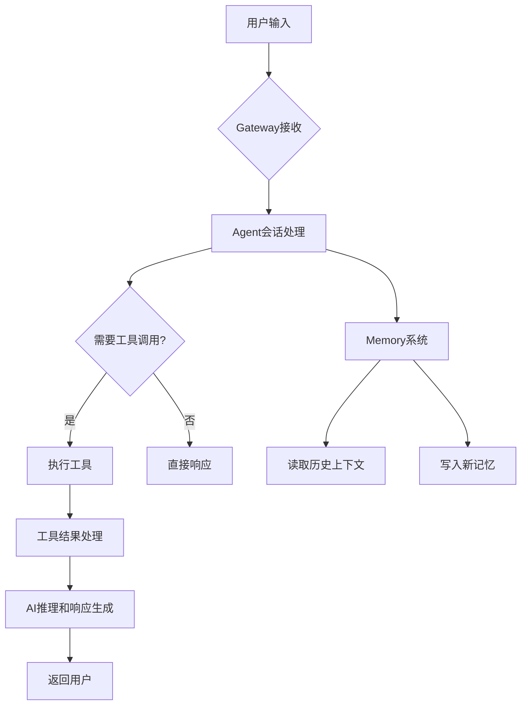

# Moltbot - 智能AI助手框架


Moltbot是一个先进的AI助手框架，旨在提供无缝的个人助理体验。通过结合大型语言模型、工具集成和智能记忆系统，Moltbot能够理解上下文、执行复杂任务并与用户进行自然对话。

## 技术架构

### 核心组件

#### 1. **Gateway守护进程**
- **作用**: Moltbot的核心运行时，管理所有会话和工具调用
- **特性**: 
  - 持久化运行，确保7x24小时可用性
  - 安全的工具执行环境
  - 会话状态管理和恢复
  - 自动更新和配置管理

#### 2. **Agent会话系统**
- **作用**: 处理用户交互和AI推理
- **特性**:
  - 支持多种AI模型（Qwen3, GPT等）
  - 上下文感知的对话管理
  - 工具调用和外部API集成
  - 子代理（sub-agent）任务分解

#### 3. **Memory记忆系统**
- **作用**: 提供长期记忆和上下文连续性
- **文件结构**:
  - `MEMORY.md`: 长期记忆，存储重要决策、偏好和知识
  - `memory/YYYY-MM-DD.md`: 日常日志，记录每日活动和事件
  - 自动记忆维护和清理

#### 4. **Skills技能系统**
- **作用**: 扩展Moltbot的功能能力
- **特性**:
  - 模块化的技能包设计
  - 标准化的SKILL.md文档格式
  - 脚本和二进制工具集成
  - ClawdHub技能市场支持

### 工作流程



### 关键技术特性

#### 🧠 **智能推理**
- **思维链（Chain-of-Thought）**: 支持复杂的多步推理
- **工具选择**: 智能选择合适的工具完成任务
- **错误恢复**: 自动检测和修复执行错误

#### 🔧 **工具集成**
- **文件操作**: 读写、编辑、搜索文件
- **系统命令**: 安全执行shell命令
- **Web交互**: 浏览器控制、网页抓取
- **消息传递**: 多平台消息发送（Telegram, Discord, Signal等）
- **定时任务**: Cron作业和提醒系统

#### 💾 **记忆管理**
- **语义搜索**: 基于向量的内存检索
- **自动摘要**: 日常活动的智能摘要
- **隐私保护**: 敏感信息的自动过滤
- **记忆优化**: 定期清理和整理记忆

#### 🌐 **多平台支持**
- **Web聊天**: 内置Web界面
- **消息平台**: Telegram, Discord, WhatsApp, Signal, iMessage等
- **浏览器扩展**: Chrome扩展实现网页交互
- **移动集成**: 节点系统支持移动设备控制

## 快速开始

### 安装要求
- Linux系统（推荐Ubuntu/CentOS）
- Node.js v18+
- Git
- Docker（可选，用于隔离环境）

### 基本使用

```bash
# 克隆仓库
git clone https://github.com/tsdlrh/moltbot.git
cd moltbot

# 查看状态
moltbot status

# 启动Gateway
moltbot gateway start

# 交互式使用
# 直接在Web界面或消息平台与Moltbot对话
```

### 常用命令

```bash
# 系统状态
moltbot status
moltbot gateway status

# 会话管理  
moltbot session list
moltbot session history <session-id>

# 技能管理
moltbot skill list
moltbot skill install <skill-name>

# 配置管理
moltbot config get
moltbot config apply
```

## 开发指南

### 创建自定义技能

1. **创建技能目录**
   ```bash
   mkdir -p /opt/moltbot/skills/my-skill
   ```

2. **编写SKILL.md**
   ```markdown
   ---
   name: my-skill
   description: My custom skill description
   metadata: {"moltbot":{"requires":{"bins":["my-tool"]}}}
   ---
   
   # Skill Documentation
   Usage instructions and examples...
   ```

3. **添加脚本或工具**
   ```bash
   mkdir -p /opt/moltbot/skills/my-skill/scripts
   # Add your scripts here
   ```

### 内存管理最佳实践

- **写入重要信息**: 使用`memory/YYYY-MM-DD.md`记录日常事件
- **更新长期记忆**: 定期将重要决策和偏好写入`MEMORY.md`
- **避免敏感数据**: 不要在记忆文件中存储密码或私密信息
- **定期清理**: 删除过时或不再相关的信息

## 安全特性

### 执行安全
- **沙箱环境**: 工具执行在受限环境中进行
- **权限控制**: 敏感操作需要明确授权
- **输入验证**: 所有外部输入都经过严格验证
- **审计日志**: 完整的操作日志记录

### 数据隐私
- **本地存储**: 所有数据默认存储在本地
- **加密传输**: 支持HTTPS和端到端加密
- **访问控制**: 基于角色的访问权限管理
- **数据最小化**: 只收集必要的数据

## 社区和支持

- **官方文档**: [https://docs.molt.bot](https://docs.molt.bot)
- **源码仓库**: [https://github.com/moltbot/moltbot](https://github.com/moltbot/moltbot)
- **社区讨论**: [Discord邀请链接](https://discord.com/invite/clawd)
- **技能市场**: [ClawdHub](https://clawdhub.com)

## 贡献指南

欢迎贡献代码、文档或新技能！请遵循以下步骤：

1. Fork仓库
2. 创建特性分支 (`git checkout -b feature/your-feature`)
3. 提交更改 (`git commit -am 'Add some feature'`)
4. 推送到分支 (`git push origin feature/your-feature`)
5. 创建Pull Request

## 许可证

Moltbot采用MIT许可证 - 详见[LICENSE](LICENSE)文件。

---

> **注意**: 本README描述的是Moltbot框架的一般架构。具体的实现细节可能因版本和配置而异。