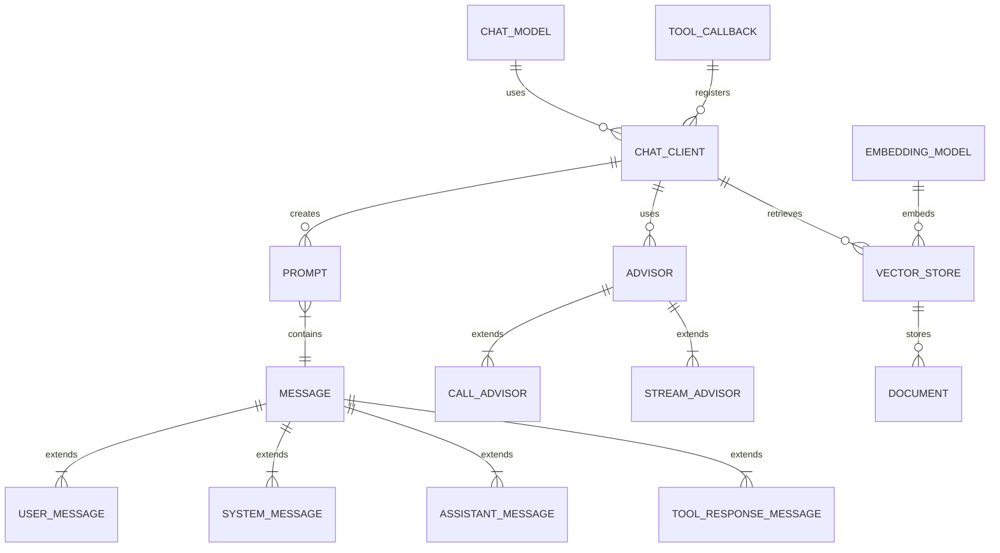
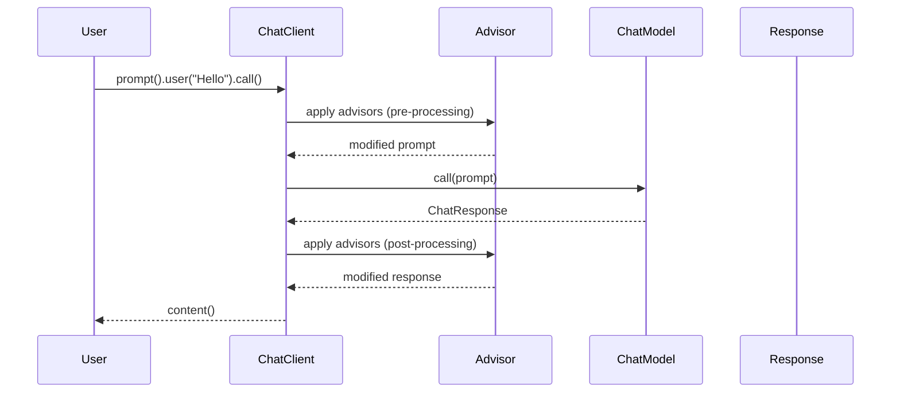
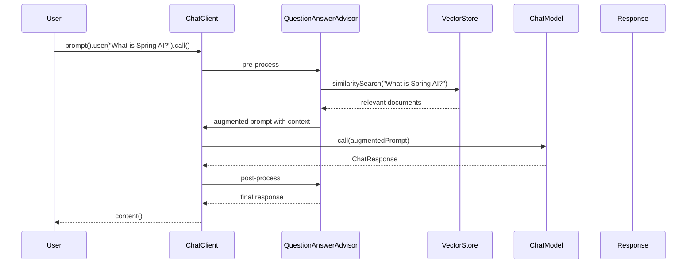
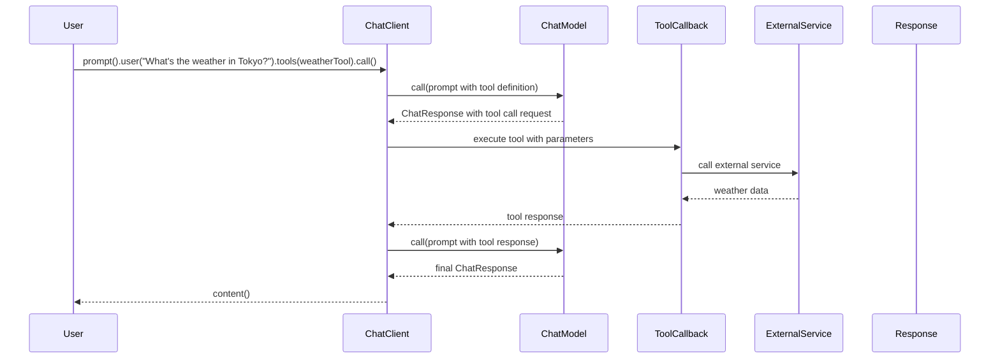

# Spring AI 架构原理

## 概述

Spring AI 是一个为 Java 开发者设计的应用框架，旨在简化 AI 功能的集成。它提供了一套抽象层，使得开发者可以轻松地在应用程序中集成各种 AI 模型和服务，而无需处理底层的复杂性。

Spring AI 的核心设计理念是：
1. **可移植性**：提供统一的 API，支持多种 AI 模型提供商
2. **模块化**：组件可以独立使用或组合使用
3. **扩展性**：易于扩展和自定义
4. **企业级集成**：与 Spring 生态系统无缝集成

## 核心架构组件

### 1. 模型层 (Model Layer)

模型层是 Spring AI 的基础，提供了与各种 AI 模型交互的接口。

#### 核心接口

- `ChatModel`: 聊天模型接口
- `EmbeddingModel`: 嵌入模型接口
- `ImageModel`: 图像生成模型接口
- `AudioTranscriptionModel`: 音频转录模型接口
- `TextToSpeechModel`: 文本转语音模型接口

### 2. 客户端层 (Client Layer)

客户端层提供了流畅的 API 来与 AI 模型交互。

#### 核心组件

- `ChatClient`: 聊天客户端，提供流畅的 API
- `EmbeddingClient`: 嵌入客户端
- `ImageClient`: 图像客户端

### 3. 向量存储层 (Vector Store Layer)

向量存储层用于存储和检索文档的向量表示，支持 RAG（检索增强生成）模式。

#### 核心接口

- `VectorStore`: 向量存储接口
- `DocumentReader`: 文档读取器
- `DocumentTransformer`: 文档转换器

### 4. 顾问层 (Advisor Layer)

顾问层提供了拦截和修改 AI 交互的能力，支持常见的 AI 模式。

#### 核心接口

- `Advisor`: 顾问基接口
- `CallAdvisor`: 调用顾问
- `StreamAdvisor`: 流式顾问

### 5. 工具层 (Tool Layer)

工具层允许 AI 模型调用外部服务和函数。

#### 核心组件

- `ToolCallback`: 工具回调
- `ToolCallbackProvider`: 工具回调提供者

## 实体类关系图 (ER Diagram)



## 核心实体类

### 1. Prompt 类

`Prompt` 类是 Spring AI 的核心实体，代表发送给 AI 模型的提示。

```java
public class Prompt implements ModelRequest<List<Message>> {
    private final List<Message> messages;
    private @Nullable ChatOptions chatOptions;
    
    // 构造函数
    public Prompt(String contents) { ... }
    public Prompt(Message message) { ... }
    public Prompt(List<Message> messages) { ... }
    
    // 获取方法
    public String getContents() { ... }
    public @Nullable ChatOptions getOptions() { ... }
    public List<Message> getInstructions() { ... }
    
    // 特定消息获取
    public SystemMessage getSystemMessage() { ... }
    public UserMessage getUserMessage() { ... }
    
    // 修改方法
    public Prompt augmentSystemMessage(Function<SystemMessage, SystemMessage> systemMessageAugmenter) { ... }
    public Prompt augmentUserMessage(Function<UserMessage, UserMessage> userMessageAugmenter) { ... }
}
```

### 2. Message 类层次结构

Message 类是所有消息类型的基类，有以下子类：

- `UserMessage`: 用户消息
- `SystemMessage`: 系统消息
- `AssistantMessage`: 助手消息
- `ToolResponseMessage`: 工具响应消息

### 3. ChatResponse 类

`ChatResponse` 类表示 AI 模型的响应。

```java
public class ChatResponse {
    private final List<Generation> generations;
    private final Map<String, Object> metadata;
    
    // 获取方法
    public List<Generation> getResults() { ... }
    public Generation getResult() { ... }
    public Map<String, Object> getMetadata() { ... }
}
```

### 4. VectorStore 类

`VectorStore` 接口定义了向量存储的操作。

```java
public interface VectorStore extends DocumentWriter, VectorStoreRetriever {
    void add(List<Document> documents);
    void delete(List<String> idList);
    void delete(Filter.Expression filterExpression);
    List<Document> similaritySearch(SearchRequest request);
}
```

## 代码执行时序逻辑图

### 1. 基本聊天流程



### 2. RAG (检索增强生成) 流程



### 3. 工具调用流程



## 核心工作流程

### 1. ChatClient 创建流程

```java
// 1. 获取 ChatClient.Builder (通过自动配置或手动创建)
ChatClient.Builder builder = ChatClient.builder(chatModel);

// 2. 配置默认设置
ChatClient chatClient = builder
    .defaultSystem("You are a helpful assistant")
    .defaultAdvisors(new SimpleLoggerAdvisor())
    .build();

// 3. 使用 ChatClient
String response = chatClient.prompt()
    .user("Tell me a joke")
    .call()
    .content();
```

### 2. RAG 实现流程

```java
// 1. 创建 VectorStore
VectorStore vectorStore = new SimpleVectorStore(embeddingModel);

// 2. 加载文档到向量存储
vectorStore.add(documentReader.get());

// 3. 创建带有 RAG 顾问的 ChatClient
ChatClient chatClient = ChatClient.builder(chatModel)
    .defaultAdvisors(QuestionAnswerAdvisor.builder(vectorStore).build())
    .build();

// 4. 使用 RAG
String response = chatClient.prompt()
    .user("What does the document say about Spring AI?")
    .call()
    .content();
```

### 3. 工具调用实现流程

```java
// 1. 定义工具
@Tool("Get current weather for a location")
public String getWeather(String location) {
    // 调用天气 API
    return weatherService.getWeather(location);
}

// 2. 创建带有工具的 ChatClient
ChatClient chatClient = ChatClient.builder(chatModel)
    .defaultTools(this) // 注册当前类中的工具方法
    .build();

// 3. 使用工具
String response = chatClient.prompt()
    .user("What's the weather in Tokyo?")
    .call()
    .content();
```

## 架构优势

### 1. 统一抽象层

Spring AI 提供了统一的 API 抽象，使得切换不同的 AI 模型提供商变得非常简单。只需要更改配置，而不需要修改业务代码。

### 2. 模块化设计

各个组件（模型、客户端、向量存储、顾问等）都是独立的模块，可以根据需要选择使用。

### 3. 企业级特性

- **可观测性**: 内置 Micrometer 集成，支持指标和追踪
- **安全性**: 与 Spring Security 集成
- **事务管理**: 支持 Spring 事务
- **配置管理**: 与 Spring Boot 配置系统集成

### 4. 扩展性

- **自定义模型**: 可以实现自己的模型适配器
- **自定义顾问**: 可以创建自己的顾问来修改请求/响应
- **自定义向量存储**: 可以实现自己的向量存储

## 总结

Spring AI 通过提供一套清晰的抽象层和模块化的设计，大大简化了在 Java 应用程序中集成 AI 功能的复杂性。它的架构设计充分考虑了企业级应用的需求，提供了良好的可扩展性和可维护性。

通过理解 Spring AI 的核心组件和工作流程，开发者可以更好地利用这个框架来构建强大的 AI 驱动的应用程序。